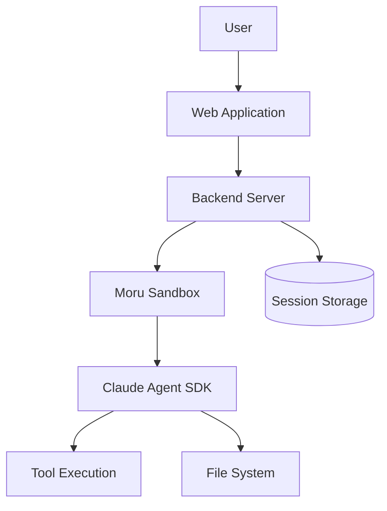

Maru is a full-featured AI agent chat application that demonstrates how to use Moru sandboxes with the Claude Agent SDK.

## Overview

Maru is an open-source example showing:

- Running Claude Agent SDK in Moru sandboxes
- Session persistence across sandbox restarts
- Real-time streaming of agent output
- Tool execution in isolated environments
- Workspace file management

<Card title="View on GitHub" icon="github" href="https://github.com/moru-ai/maru">
  Explore the complete source code.
</Card>

## Architecture



### Components

| Component | Description |
|-----------|-------------|
| Web App | React-based chat interface |
| Backend | Node.js server managing sandboxes |
| Sandbox | Moru sandbox running the agent |
| Agent | Claude Agent SDK for AI reasoning |
| Storage | Session and workspace persistence |

## Key Features

### 1. Sandbox Lifecycle Management

```typescript
// Create a sandbox for a new session
const sandbox = await Sandbox.create("claude-agent-template", {
  metadata: { userId, sessionId },
  timeout: 3600  // 1 hour
})

// Start the agent process
await sandbox.commands.run("claude-code start", { background: true })
```

### 2. Session Persistence

Sessions are preserved across sandbox restarts:

```typescript
// Save session before pausing
const sessionData = await sandbox.files.read("~/.claude/session.jsonl")
await storage.save(sessionId, sessionData)

// Restore session on resume
await sandbox.files.write("~/.claude/session.jsonl", sessionData)
```

### 3. Real-time Streaming

Stream agent output to the user:

```typescript
await sandbox.commands.run("claude-code message", {
  onStdout: (data) => {
    ws.send(JSON.stringify({ type: "output", data }))
  }
})
```

### 4. Tool Execution

The agent executes tools in the sandbox:

```typescript
// Agent runs code
const result = await sandbox.commands.run("python3 script.py")

// Agent modifies files
await sandbox.files.write("/workspace/app.py", code)

// Agent runs tests
const testResult = await sandbox.commands.run("pytest")
```

## Quick Start

### Prerequisites

- Node.js 18+
- Moru API key
- Anthropic API key

### Setup

```bash
# Clone the repository
git clone https://github.com/moru-ai/maru
cd maru

# Install dependencies
npm install

# Configure environment
cp .env.example .env
# Edit .env with your API keys

# Start the application
npm run dev
```

### Environment Variables

```bash
# .env
MORU_API_KEY=moru_...
ANTHROPIC_API_KEY=sk-ant-...
DATABASE_URL=postgres://...
```

## Project Structure

```
maru/
├── apps/
│   ├── web/              # React frontend
│   │   ├── src/
│   │   │   ├── components/
│   │   │   └── hooks/
│   │   └── package.json
│   └── server/           # Node.js backend
│       ├── src/
│       │   ├── routes/
│       │   ├── services/
│       │   └── sandbox/
│       └── package.json
├── packages/
│   └── shared/           # Shared types
└── docker/
    └── agent/            # Agent Dockerfile
```

## Template Setup

The agent runs in a custom Moru template:

```typescript
const template = Template()
  .fromPythonImage("3.11")
  .runCmd("pip install anthropic")
  .copy("./agent", "/app")
  .setStartCmd("python /app/main.py", waitForPort(8080))

await Template.build(template, { alias: "claude-agent-template" })
```

## Sandbox Management

### Creating Sessions

```typescript
async function createSession(userId: string) {
  const sessionId = generateId()

  const sandbox = await Sandbox.create("claude-agent-template", {
    metadata: { userId, sessionId },
    envs: {
      ANTHROPIC_API_KEY: process.env.ANTHROPIC_API_KEY
    }
  })

  return { sessionId, sandboxId: sandbox.sandboxId }
}
```

### Resuming Sessions

```typescript
async function resumeSession(sessionId: string) {
  const session = await storage.get(sessionId)

  const sandbox = await Sandbox.connect(session.sandboxId)
  await sandbox.connect()  // Resume if paused

  return sandbox
}
```

### Cleanup

```typescript
async function cleanupSession(sessionId: string) {
  const session = await storage.get(sessionId)

  // Save state
  const workspace = await sandbox.files.read("/workspace", { format: "bytes" })
  await storage.saveWorkspace(sessionId, workspace)

  // Kill sandbox
  await sandbox.kill()
}
```

## Learn More

<CardGroup cols={2}>
  <Card title="GitHub Repository" icon="github" href="https://github.com/moru-ai/maru">
    View source code and contribute.
  </Card>
  <Card title="Claude Agent SDK Guide" icon="robot" href="/guides/claude-agent-sdk/overview">
    Learn about Claude Agent SDK integration.
  </Card>
</CardGroup>
