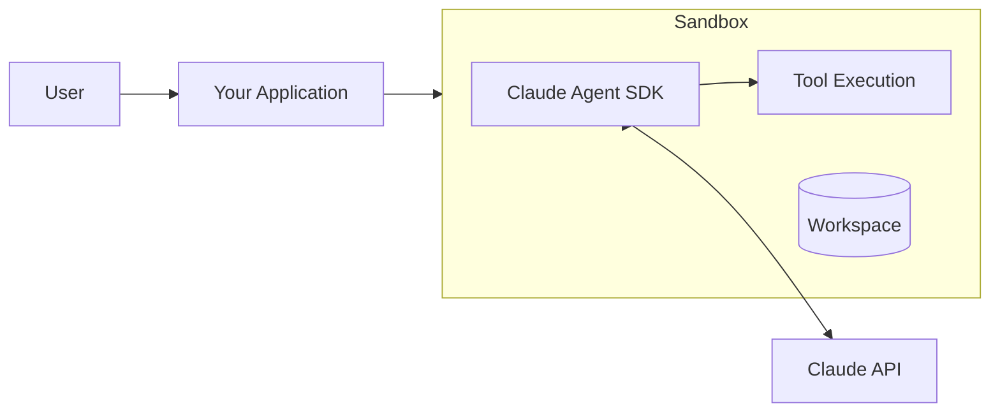

This guide explains how to run Claude Agent SDK (also known as Claude Code) in Moru sandboxes for building AI-powered development assistants.

## What is Claude Agent SDK?

Claude Agent SDK is Anthropic's official CLI tool for Claude that enables:

- Interactive AI-assisted coding
- Tool execution (file operations, shell commands)
- Extended thinking for complex reasoning
- Session persistence for long-running tasks

## Why Use Moru for Claude Agents?

Running Claude agents in Moru sandboxes provides:

<CardGroup cols={2}>
  <Card title="Isolation" icon="shield-halved">
    Each agent runs in a dedicated microVM, preventing one agent's actions from affecting others.
  </Card>
  <Card title="Security" icon="lock">
    Sandboxes limit what agents can access, protecting sensitive systems.
  </Card>
  <Card title="Persistence" icon="floppy-disk">
    Pause and resume sandboxes to maintain agent state across sessions.
  </Card>
  <Card title="Scalability" icon="chart-line">
    Spin up sandboxes on demand for concurrent agent sessions.
  </Card>
</CardGroup>

## Architecture



### Components

| Component | Description |
|-----------|-------------|
| Your Application | Backend managing sandbox lifecycle |
| Moru Sandbox | Isolated environment for the agent |
| Claude Agent SDK | Anthropic's agent framework |
| Claude API | Anthropic's LLM API |
| Workspace | Persistent filesystem for agent work |

## Quick Example

Create a sandbox with Claude Agent SDK and run a task:

<CodeGroup>
```python Python
from moru import Sandbox

# Create a sandbox with Claude Code pre-installed
sandbox = Sandbox.create("claude-code-template", {
    "envs": {
        "ANTHROPIC_API_KEY": "sk-ant-..."
    }
})

# Run an agent task
result = sandbox.commands.run(
    "claude -p 'Create a hello world Python script'",
    timeout=120,
    on_stdout=lambda data: print(data, end="")
)

# Check the created file
content = sandbox.files.read("/home/user/hello.py")
print(content)

sandbox.kill()
```

```javascript JavaScript
import Sandbox from '@moru-ai/core'

// Create a sandbox with Claude Code pre-installed
const sandbox = await Sandbox.create("claude-code-template", {
  envs: {
    ANTHROPIC_API_KEY: "sk-ant-..."
  }
})

// Run an agent task
const result = await sandbox.commands.run(
  "claude -p 'Create a hello world Python script'",
  {
    timeoutMs: 120000,
    onStdout: (data) => process.stdout.write(data)
  }
)

// Check the created file
const content = await sandbox.files.read("/home/user/hello.py")
console.log(content)

await sandbox.kill()
```
</CodeGroup>

## Key Concepts

### Session Management

Claude Agent SDK maintains session state in JSONL files. This enables:

- Resuming conversations across sandbox restarts
- Preserving context between interactions
- Auditing agent actions

### Workspace Persistence

The agent's workspace (files, configuration) can be:

- Saved before pausing a sandbox
- Restored when resuming
- Synced to external storage

### Tool Execution

Claude Agent SDK executes tools within the sandbox:

- **File operations**: Read, write, edit files
- **Shell commands**: Run any shell command
- **Code execution**: Run Python, Node.js, etc.

All within the secure sandbox environment.

## Use Cases

### Development Assistants

Build AI coding assistants that can:

- Write and edit code
- Run tests
- Debug issues
- Manage git operations

### Data Processing

Create agents that:

- Transform data files
- Run analysis scripts
- Generate reports

### Automation

Automate workflows with agents that:

- Execute multi-step tasks
- Handle errors gracefully
- Persist state across runs

## Next Steps

<CardGroup cols={2}>
  <Card title="Setup & Deployment" icon="gear" href="/guides/claude-agent-sdk/setup">
    Set up Claude Agent SDK in Moru.
  </Card>
  <Card title="Session Persistence" icon="floppy-disk" href="/guides/claude-agent-sdk/session-persistence">
    Persist and resume agent sessions.
  </Card>
  <Card title="Session Schemas" icon="code" href="/guides/claude-agent-sdk/schemas">
    Understand session file formats.
  </Card>
  <Card title="Complete Example" icon="rocket" href="/guides/claude-agent-sdk/example">
    See a full working example.
  </Card>
</CardGroup>
