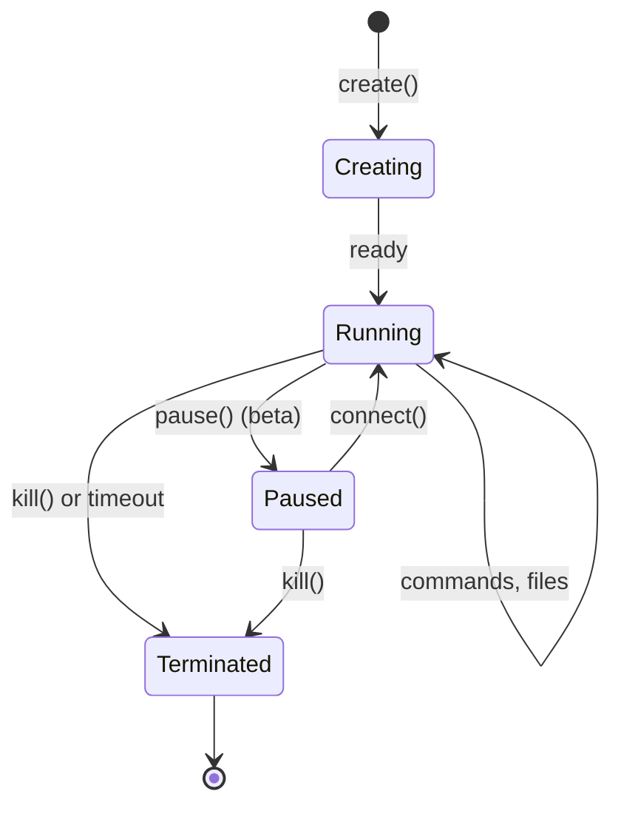

A sandbox is an isolated compute environment running in a Firecracker microVM. Each sandbox provides a complete Linux environment with its own filesystem, network stack, and process space.

## Lifecycle

Sandboxes follow a simple lifecycle:



### States

| State | Description |
|-------|-------------|
| **Running** | Sandbox is active and accepting operations |
| **Paused** | Sandbox is suspended (beta feature) - filesystem preserved |
| **Terminated** | Sandbox is stopped and resources released |

## Resource Allocation

Each sandbox has dedicated resources:

| Resource | Default | Maximum |
|----------|---------|---------|
| vCPUs | 2 | Depends on plan |
| Memory | 512 MB | 4 GB (base tier) |
| Disk | 10 GB | 10 GB |
| Timeout | 5 minutes | 1 hour (hobby) / 24 hours (pro) |

## Sandbox Properties

When you create a sandbox, you get access to several properties:

<CodeGroup>
```python Python
from moru import Sandbox

sandbox = Sandbox.create()

# Unique identifier
print(sandbox.sandbox_id)  # e.g., "sbx_abc123..."

# Access filesystem, commands, and PTY
sandbox.files      # Filesystem operations
sandbox.commands   # Command execution
sandbox.pty        # Interactive terminal
```

```javascript JavaScript
import Sandbox from '@moru-ai/core'

const sandbox = await Sandbox.create()

// Unique identifier
console.log(sandbox.sandboxId)  // e.g., "sbx_abc123..."

// Access filesystem, commands, and PTY
sandbox.files      // Filesystem operations
sandbox.commands   // Command execution
sandbox.pty        // Interactive terminal
```
</CodeGroup>

## Network Access

By default, sandboxes have outbound internet access. You can control this:

<CodeGroup>
```python Python
from moru import Sandbox

# Disable internet access entirely
sandbox = Sandbox.create(allow_internet_access=False)

# Or restrict to specific hosts
sandbox = Sandbox.create(
    network={
        "allow_out": ["api.example.com", "1.1.1.1"],
        "deny_out": ["internal.example.com"],
    }
)
```

```javascript JavaScript
import Sandbox from '@moru-ai/core'

// Disable internet access entirely
const sandbox = await Sandbox.create({ allowInternetAccess: false })

// Or restrict to specific hosts
const sandbox = await Sandbox.create({
  network: {
    allowOut: ["api.example.com", "1.1.1.1"],
    denyOut: ["internal.example.com"],
  }
})
```
</CodeGroup>

## Exposing Ports

Sandboxes can expose HTTP services to the internet:

<CodeGroup>
```python Python
from moru import Sandbox

sandbox = Sandbox.create()

# Start a web server
sandbox.commands.run("python3 -m http.server 8080", background=True)

# Get the public URL for port 8080
host = sandbox.get_host(8080)
print(f"Server available at: https://{host}")
```

```javascript JavaScript
import Sandbox from '@moru-ai/core'

const sandbox = await Sandbox.create()

// Start a web server
await sandbox.commands.run("python3 -m http.server 8080", { background: true })

// Get the public URL for port 8080
const host = sandbox.getHost(8080)
console.log(`Server available at: https://${host}`)
```
</CodeGroup>

## Metadata

Attach custom metadata to sandboxes for filtering and organization:

<CodeGroup>
```python Python
from moru import Sandbox

sandbox = Sandbox.create(
    metadata={
        "user_id": "user_123",
        "project": "my-agent",
        "environment": "production"
    }
)
```

```javascript JavaScript
import Sandbox from '@moru-ai/core'

const sandbox = await Sandbox.create({
  metadata: {
    userId: "user_123",
    project: "my-agent",
    environment: "production"
  }
})
```
</CodeGroup>

## Environment Variables

Set environment variables available to all commands:

<CodeGroup>
```python Python
from moru import Sandbox

sandbox = Sandbox.create(
    envs={
        "API_KEY": "secret_key",
        "DEBUG": "true"
    }
)

result = sandbox.commands.run("echo $API_KEY")
print(result.stdout)  # secret_key
```

```javascript JavaScript
import Sandbox from '@moru-ai/core'

const sandbox = await Sandbox.create({
  envs: {
    API_KEY: "secret_key",
    DEBUG: "true"
  }
})

const result = await sandbox.commands.run("echo $API_KEY")
console.log(result.stdout)  // secret_key
```
</CodeGroup>

## Next Steps

<CardGroup cols={2}>
  <Card title="Create Sandbox" icon="plus" href="/sandbox/create">
    Learn all sandbox creation options.
  </Card>
  <Card title="Connect to Sandbox" icon="plug" href="/sandbox/connect">
    Reconnect to existing sandboxes.
  </Card>
  <Card title="Kill Sandbox" icon="xmark" href="/sandbox/kill">
    Terminate sandboxes properly.
  </Card>
  <Card title="Timeout & Lifecycle" icon="clock" href="/sandbox/timeout">
    Manage sandbox timeouts.
  </Card>
</CardGroup>
