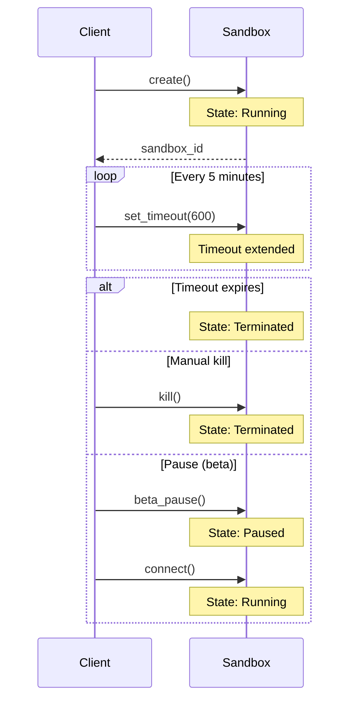

Sandboxes automatically terminate after a timeout period. This prevents runaway costs and ensures resources are released.

## Default Timeout

The default timeout is **5 minutes** (300 seconds). After this period of inactivity, the sandbox is automatically killed.

<CodeGroup>
```python Python
from moru import Sandbox

# Default 5-minute timeout
sandbox = Sandbox.create()

# Custom timeout (10 minutes)
sandbox = Sandbox.create(timeout=600)
```

```javascript JavaScript
import Sandbox from '@moru-ai/core'

// Default 5-minute timeout
const sandbox = await Sandbox.create()

// Custom timeout (10 minutes)
const sandbox = await Sandbox.create({ timeoutMs: 600000 })
```
</CodeGroup>

## Maximum Timeout

The maximum timeout for all accounts is **1 hour**.

Need longer sandbox duration? Contact us at [hi@moru.io](mailto:hi@moru.io).

## Extend Timeout

Extend the timeout of a running sandbox:

<CodeGroup>
```python Python
from moru import Sandbox

sandbox = Sandbox.create()

# Extend timeout by 30 minutes from now
sandbox.set_timeout(1800)  # seconds

# Or using static method
Sandbox.set_timeout("sbx_abc123...", 1800)
```

```javascript JavaScript
import Sandbox from '@moru-ai/core'

const sandbox = await Sandbox.create()

// Extend timeout by 30 minutes from now
await sandbox.setTimeout(1800000)  // milliseconds
```
</CodeGroup>

## Check Remaining Time

Get the sandbox info to see when it will terminate:

<CodeGroup>
```python Python
from moru import Sandbox
from datetime import datetime

sandbox = Sandbox.create()
info = sandbox.get_info()

remaining = info.end_at - datetime.now(info.end_at.tzinfo)
print(f"Sandbox expires in {remaining.total_seconds()} seconds")
```

```javascript JavaScript
import Sandbox from '@moru-ai/core'

const sandbox = await Sandbox.create()
const info = await sandbox.getInfo()

const remaining = info.endAt.getTime() - Date.now()
console.log(`Sandbox expires in ${remaining / 1000} seconds`)
```
</CodeGroup>

## Keep-Alive Pattern

For long-running agents, periodically extend the timeout:

<CodeGroup>
```python Python
import threading
from moru import Sandbox

sandbox = Sandbox.create()

def keep_alive():
    while True:
        try:
            sandbox.set_timeout(600)  # Extend by 10 minutes
            time.sleep(300)  # Check every 5 minutes
        except Exception:
            break  # Sandbox was killed

# Start keep-alive in background
thread = threading.Thread(target=keep_alive, daemon=True)
thread.start()

# Do your work...
```

```javascript JavaScript
import Sandbox from '@moru-ai/core'

const sandbox = await Sandbox.create()

// Keep-alive interval
const keepAlive = setInterval(async () => {
  try {
    await sandbox.setTimeout(600000)  // Extend by 10 minutes
  } catch {
    clearInterval(keepAlive)  // Sandbox was killed
  }
}, 300000)  // Check every 5 minutes

// Do your work...

// Clean up
clearInterval(keepAlive)
await sandbox.kill()
```
</CodeGroup>

## Auto-Pause (Beta)

Instead of terminating, sandboxes can automatically pause when idle:

<CodeGroup>
```python Python
from moru import Sandbox

# Auto-pause after 5 minutes of inactivity
sandbox = Sandbox.beta_create(
    template="python",
    auto_pause=True,
    auto_pause_timeout=300
)

# Do some work
sandbox.commands.run("echo 'Hello'")

# If idle for 5 minutes, sandbox pauses instead of terminating
# Resume later with:
sandbox.connect()
```

```javascript JavaScript
import Sandbox from '@moru-ai/core'

// Auto-pause after 5 minutes of inactivity
const sandbox = await Sandbox.betaCreate("python", {
  autoPause: true,
  autoPauseTimeout: 300
})

// Do some work
await sandbox.commands.run("echo 'Hello'")

// If idle for 5 minutes, sandbox pauses instead of terminating
// Resume later with:
await sandbox.connect()
```
</CodeGroup>

<Note>
  Auto-pause is a beta feature. Paused sandboxes preserve filesystem state but still count toward your quota.
</Note>

## Timeout Errors

When a sandbox times out during an operation:

<CodeGroup>
```python Python
from moru import Sandbox
from moru.exceptions import TimeoutException

sandbox = Sandbox.create(timeout=60)

try:
    # This might timeout if the command takes too long
    result = sandbox.commands.run("sleep 120", timeout=90)
except TimeoutException:
    print("Command or sandbox timed out")
    # Check if sandbox is still running
    if not sandbox.is_running():
        print("Sandbox was terminated")
```

```javascript JavaScript
import Sandbox, { TimeoutError } from '@moru-ai/core'

const sandbox = await Sandbox.create({ timeoutMs: 60000 })

try {
  // This might timeout if the command takes too long
  const result = await sandbox.commands.run("sleep 120", { timeoutMs: 90000 })
} catch (error) {
  if (error instanceof TimeoutError) {
    console.log("Command or sandbox timed out")
    // Check if sandbox is still running
    if (!(await sandbox.isRunning())) {
      console.log("Sandbox was terminated")
    }
  }
}
```
</CodeGroup>

## Lifecycle Events

The sandbox goes through these states:

1. **Creating** - Sandbox is being provisioned
2. **Running** - Sandbox is active and accepting operations
3. **Paused** (beta) - Sandbox is suspended, can be resumed
4. **Terminated** - Sandbox is stopped, cannot be recovered



## Next Steps

<CardGroup cols={2}>
  <Card title="Kill Sandbox" icon="xmark" href="/sandbox/kill">
    Manually terminate sandboxes.
  </Card>
  <Card title="Resource Quotas" icon="gauge" href="/limits/quotas">
    Learn about resource limits.
  </Card>
</CardGroup>
