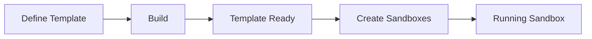

Templates define the starting state of a sandbox: the base image, installed packages, and startup configuration. Use built-in templates or create custom ones.

## Built-in Templates

| Template | Description |
|----------|-------------|
| `base` | Minimal Ubuntu with essential tools |
| `python` | Python 3 with common packages (numpy, pandas, etc.) |
| `node` | Node.js LTS with npm |
| `bun` | Bun runtime |

<CodeGroup>
```python Python
from moru import Sandbox

# Use built-in templates
sandbox = Sandbox.create("base")
sandbox = Sandbox.create("python")
sandbox = Sandbox.create("node")
```

```javascript JavaScript
import Sandbox from '@moru-ai/core'

// Use built-in templates
const sandbox = await Sandbox.create("base")
const sandbox = await Sandbox.create("python")
const sandbox = await Sandbox.create("node")
```
</CodeGroup>

## Custom Templates

Create templates with your specific dependencies:

<CodeGroup>
```python Python
from moru import Template

# Define a custom template
template = (
    Template()
    .from_python_image("3.11")
    .pip_install(["requests", "beautifulsoup4", "selenium"])
    .apt_install(["chromium-browser", "chromium-chromedriver"])
    .set_envs({"CHROME_BIN": "/usr/bin/chromium-browser"})
    .set_start_cmd("bash", "echo 'Ready'")
)

# Build the template
info = Template.build(template, alias="web-scraper")
print(f"Template built: {info.template_id}")

# Now use it
sandbox = Sandbox.create("web-scraper")
```

```javascript JavaScript
import { Template } from '@moru-ai/core'
import Sandbox from '@moru-ai/core'

// Define a custom template
const template = Template()
  .fromPythonImage("3.11")
  .pipInstall(["requests", "beautifulsoup4", "selenium"])
  .aptInstall(["chromium-browser", "chromium-chromedriver"])
  .setEnvs({ CHROME_BIN: "/usr/bin/chromium-browser" })
  .setStartCmd("bash", "echo 'Ready'")

// Build the template
const info = await Template.build(template, { alias: "web-scraper" })
console.log(`Template built: ${info.templateId}`)

// Now use it
const sandbox = await Sandbox.create("web-scraper")
```
</CodeGroup>

## Template Lifecycle



1. **Define**: Specify base image, packages, and configuration
2. **Build**: Moru builds and caches the template
3. **Ready**: Template is available for use
4. **Create**: Sandboxes start instantly from the cached template

## Template Benefits

<CardGroup cols={2}>
  <Card title="Fast Startup" icon="bolt">
    Sandboxes start in seconds with all dependencies pre-installed.
  </Card>
  <Card title="Consistency" icon="equals">
    Every sandbox starts with the exact same environment.
  </Card>
  <Card title="Cost Efficiency" icon="coins">
    Install once, use many times - no repeated package downloads.
  </Card>
  <Card title="Version Control" icon="code-branch">
    Track template changes and roll back if needed.
  </Card>
</CardGroup>

## Template Components

### Base Image

Start from an official image:

```python
Template().from_python_image("3.11")
Template().from_node_image("lts")
Template().from_ubuntu_image("22.04")
Template().from_base_image()  # Moru's optimized base
```

### Packages

Install packages during build:

```python
template = (
    Template()
    .from_python_image("3.11")
    .pip_install(["numpy", "pandas", "scikit-learn"])
    .apt_install(["libpq-dev", "build-essential"])
    .npm_install(["typescript", "eslint"], g=True)
)
```

### Files

Copy files into the template:

```python
template = (
    Template()
    .from_base_image()
    .copy("./config", "/app/config")
    .copy(["./src", "./lib"], "/app")
)
```

### Startup

Configure how sandboxes start:

```python
template = (
    Template()
    .from_node_image()
    .copy("./app", "/app")
    .set_workdir("/app")
    .set_start_cmd("node server.js", "curl localhost:3000/health")
)
```

## Next Steps

<CardGroup cols={2}>
  <Card title="Build Templates" icon="hammer" href="/templates/build">
    Learn the template builder API.
  </Card>
  <Card title="Dockerfile Support" icon="docker" href="/templates/dockerfile">
    Build from existing Dockerfiles.
  </Card>
  <Card title="Container Registries" icon="database" href="/templates/registries">
    Use private registries.
  </Card>
  <Card title="Dashboard" icon="gauge" href="/templates/dashboard">
    Manage templates in the dashboard.
  </Card>
</CardGroup>
